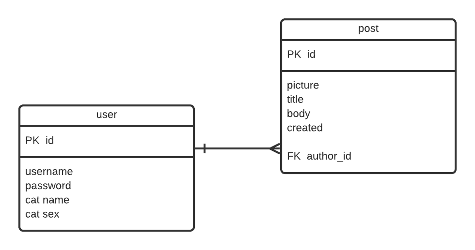
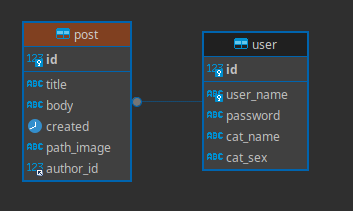

# Cats Blog

## Descrição

Este é um projeto de desenvolvimento de um blog para compartilhamento de posts relacionados a gatos. O objetivo principal é fornecer uma plataforma onde os usuários possam se cadastrar, fazer login, criar, editar e excluir posts, bem como gerenciar informações sobre seus próprios gatos.


## Requisitos de forma resumida

Aqui estão os requisitos bem gerais para o Cats Blog:

1. **Registro de Usuário:**
   - Os usuários devem ser capazes de se registrar fornecendo as seguintes informações: username, password, nome do gato e sexo do gato.

2. **Login de Usuário:**
   - Os usuários devem poder fazer login usando seu username e password.

3. **Visualização de Perfil:**
   - Usuários logados devem poder visualizar os dados do seu perfil, incluindo username, nome do gato e sexo do gato.

4. **Edição de Perfil:**
   - Os usuários devem poder editar algumas informações do seu perfil, como nome do gato e sexo do gato.

5. **Exclusão de Conta:**
   - Os usuários devem poder excluir sua conta do blog. Ao excluir a conta, todos os posts associados ao usuário devem ser removidos.

6. **Gerenciamento de Posts:**
   - Usuários logados devem poder criar, editar ou excluir posts. Eles só devem ser capazes de editar ou excluir os posts que eles mesmos criaram.


## DER – diagrama de entidade e relacionamento:
    - Modelo bem simplificado somente para fazer a aplicação. Podemos modelar de uma forma mais complexa. Um Post pode ser composta de uma entidade Imagem, Categoria... o User pode ser granularizado e criarmos uma entidade Gato e uma entidade Pessoa...
  
## Modelo Físico simplificado:


## No banco


## Instalação e Uso (COM DOCKER e DOCKER COMPOSE)

1. Clone este repositório em sua máquina local:

    ```
    git clone git@github.com:pauloh-alc/cats_blog.git
    ```

    ou

    ```
    git clone https://github.com/pauloh-alc/cats_blog.git
    ```

2. Acesse a pasta do projeto:

    ```
    cd cats_blog
    ```

3. Construa seus containers e suba eles:

    ```
    sudo docker-compose up --build
    ```

4. Acesse localhost:5000 em seu navegador:


## Instalação e Uso (SEM DOCKER)

Para executar o Cats Blog em seu ambiente local, siga estas etapas:

1. Clone este repositório em sua máquina local:

    ```
    git clone git@github.com:pauloh-alc/cats_blog.git
    ```

    ou

    ```
    git clone https://github.com/pauloh-alc/cats_blog.git
    ```

2. Acesse a pasta do projeto:

    ```
    cd cats_blog
    ```

3. Crie e ative o ambiente virtual:
    ```
    python3 -m venv .venv
    ```
    ```
    souce .venv/bin/activate
    ```

4. Instale as dependências:

    ```
    pip install -r requirements.txt
    ```

## Instalando o mysql-server e mysql-client

1. Atualize seus pacotes e instale o mysql-server e mysql-client:
   
    ```
    sudo apt update
    ```
    ```
    sudo apt upgrade
    ```
    ```
    sudo apt install mysql-server mysql-client
    ```

2. Verifique se o mysql está ativado:

    ```
    sudo systemctl status mysql
    ```

3. Coloque uma senha:

    ```
    sudo mysql -r root -p
    ```
    ```
    ALTER USER 'root'@'localhost' IDENTIFIED WITH mysql_native_password BY '123456';
    ```

4. Instale o mysql-workbench - recomendo ir no próprio site e baixar o pacote .deb da sua versão de linux
 
    ```
    sudo dpkg -i <seu-pacote-do-mysql.deb>
    ```
    ou
    ```
    sudo apt install mysql-workbench
    ```
5. Abra o mysql-workbench, crie um conexão com nome qualquer, dentro dela crie um schema chamado cats_blog

6. Por fim, rode a aplicação:  
    ```
    flask --app app run --debug
    ```